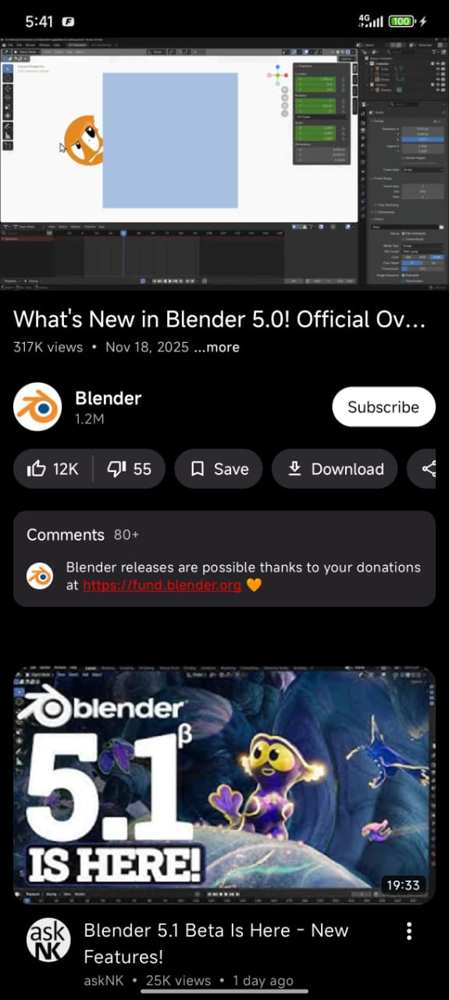
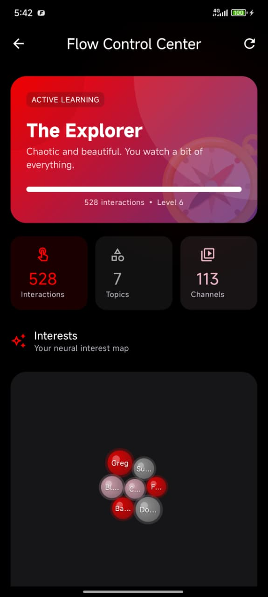
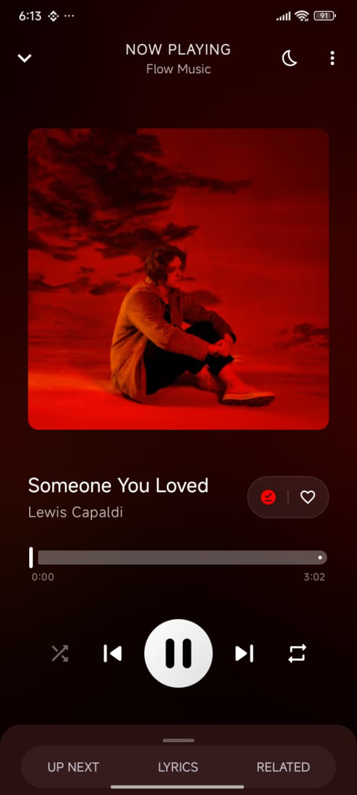
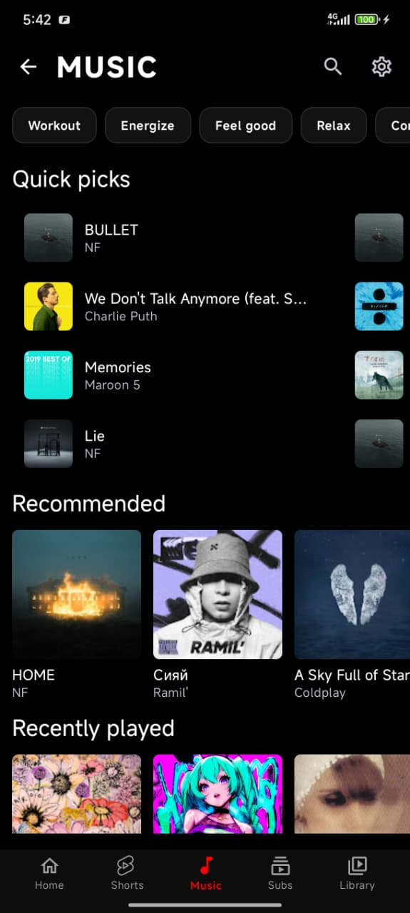

# gtube

<h3>عميل يوتيوب ويوتيوب ميوزيك يحترم خصوصيتك على أندرويد، مع محرك توصيات يعمل بالكامل على جهازك.</h3>

 

 

**[تحميل النسخ](#تحميل-النسخ)** · **[المميزات](#المميزات)** · **[المنصات المدعومة](#المنصات-المدعومة)** · **[الشكر والاعتراف](#الشكر-والاعتراف)**

---

## تنويه مهم: هذا مشروع مشتق من Flow

> **gtube هي نسخة معدّلة (Fork) من مشروع [Flow](https://github.com/A-EDev/Flow) العريق** الذي طوّره المطور المبدع **[(A-EDev)](https://github.com/A-EDev)**.
>
> كل الشكر والامتنان له وللجميع من أسهموا في المشروع الأصلي على هذا العمل الرائع. هذا المستودع هو نسخة معدّلة من عمله لأغراض شخصية، وجميع الفضل في الفكرة والتصميم والبنية الأساسية يعود له وللمجتمع المشارك في المشروع الأصلي.

## نبذة عن التطبيق

gtube هو تطبيق عميل لمشاهدة محتوى يوتيوب ويوتيوب ميوزيك مبني بتقنيات Jetpack Compose و Material 3 الحديثة، ويمنحك تجربة مشاهدة كاملة دون إعلانات ودون تتبع ودون الحاجة إلى حساب جوجل. يضم التطبيق محرك توصيات ذكي يعمل بالكامل على جهازك ويحلل ما تشاهده محلياً ليقترح عليك محتوى يناسب ذوقك، دون أن تخرج أي بيانات من هاتفك إطلاقاً.

معظم عملاء يوتيوب مفتوحة المصدر يمنحونك التشغيل فقط دون طريقة لاكتشاف محتوى جديد، فأنت إما تستخدم التطبيق الرسمي وتُتتبَّع، أو تستخدم بديلاً وتفقد التوصيات نهائياً. gtube يمنحك الاثنين معاً: محرك التوصيات يتعلم ما تحب من سلوك مشاهدتك محلياً، ويمكنك الاطلاع على كل ما يعرفه عنك في أي وقت وتعديله أو حذفه نهائياً.

## المنصات المدعومة

| المنصة | الحد الأدنى | ملاحظات |
|:---:|:---:|:---|
| 📱 هواتف وأجهزة لوحية أندرويد | Android 8.0 (API 26) | التجربة الكاملة بجميع المميزات |
| 📺 أندرويد TV | Android 8.0 (API 26) | واجهة مخصصة للتلفزيون مع تنقل بالريموت |

التطبيق مبني بالكامل بلغة **Kotlin** مع **Jetpack Compose** و **Material 3**، ويعتمد على **ExoPlayer (Media3)** لتشغيل الوسائط و **NewPipeExtractor** لاستخراج بيانات يوتيوب.

---

## المميزات

### 🎬 الفيديو
- تشغيل عالي الجودة عبر ExoPlayer (Media3) مع تبديل الدقة (1080p و 720p و 480p و 360p)
- SponsorBlock — تخطي تلقائي للإعلانات المدمجة والمقدمات والخواتم والحشو
- DeArrow — استبدال الصور المصغرة والعناوين الутكورية ببدائل من المجتمع
- إعادة تفعيل زر عدم الإعجاب في يوتيوب (Return YouTube Dislike)
- التشغيل في الخلفية — استمع للصوت مع إيقاف الشاشة
- صورة داخل صورة (Picture-in-Picture) — واصل المشاهدة أثناء استخدام تطبيقات أخرى
- البث إلى أجهزة التلفزيون الذكية وأجهزة البث
- التحكم في سرعة التشغيل (من 0.25x إلى 2x)
- فصول الفيديو مع التنقل السريع بينها
- إيماءات التحكم في السطوع والصوت والتقديم
- الترجمة مع تخصيص حجم الخط ولونه والخلفية
- تنزيل الفيديوهات بدعم صيغ VP9 و AV1 والصيغ القياسية
- استئناف المشاهدة من حيث توقفت

### 🎵 الموسيقى
- مشغل موسيقى مخصص مع صور الألبوم وتأثيرات بصرية صوتية
- إدارة قائمة الانتظار مع الإضافة والحذف وإعادة الترتيب
- التشغيل العشوائي والتكرار (فردي / الكل)
- مشغل مصغّر دائم عبر أرجاء التطبيق
- عرض كلمات الأغاني المتزامنة
- جلب المقاطع من يوتيوب ميوزيك

### 🧠 محرك التوصيات (FlowNeuro)
- يعمل 100% على جهازك — بلا خوادم وبلا تتبع وبلا حساب
- يتعلم مما تشاهده وتتخطاه وتعجب به وتبحث عنه ومدة مشاهدتك
- يميز أنماط أيام الأسبوع عن عطلة نهاية الأسبوع، وتفضيلات الصباح عن المساء
- يكتشف مللك من موضوع ما ويمزج محتوى جديداً في واجهتك
- يمنع واجهتك من الانغلاق على موضوعين أو ثلاثة
- يعرض مقاطع ذات صلة من مشاهداتك الأخيرة لانتقالات طبيعية بين المواضيع
- يستخدم إشارات التفاعل (نسبة الإعجابات إلى المشاهدات) لتصفية المحتوى الرديء
- لوحة شفافية كاملة — شاهد ما يعرفه المحرك عنك ولماذا اقترح شيئاً ما
- تصدير/استيراد ملف تعريف التوصيات الخاص بك بالكامل

### 📚 المكتبة
- سجل مشاهدة محلي
- المفضلة وقوائم التشغيل المخصصة
- واجهة Shorts مع حفظ المقاطع
- رف "أكمل المشاهدة"
- إدارة الاشتراكات مع تخزين مؤقت للواجهات

### 🔒 الخصوصية
- لا حاجة لأي حساب جوجل
- بلا إعلانات أو تحليلات أو تتبع
- جميع البيانات محفوظة محلياً على جهازك
- استيراد الاشتراكات والسجل من NewPipe
- تصدير أو حذف كل شيء في أي وقت

### 🎨 المظهر
- 11 ثيمًا: فاتح، داكن، أسود OLED، أزرق محيطي، أخضر غابات، برتقالي الغروب، سديم بنفسجي، أسود منتصف الليل، ذهبي وردي، جليدي قطبي، أحمر قرمزي
- مدمج بالكامل مع Jetpack Compose و Material 3

---

## لقطات الشاشة

  <table>
    <tr>
      <td align="center"><b>الرئيسية</b> </td>
      <td align="center"><b>مشغل الفيديو</b> </td>
      <td align="center"><b>شخصيتك</b> </td>
    </tr>
    <tr>
      <td align="center"><b>مشغل الموسيقى</b> </td>
      <td align="center"><b>مركز الموسيقى</b> </td>
      <td align="center"><b>مكتبتك</b> </td>
    </tr>
    <tr>
      <td align="center"><b>Shorts</b> </td>
      <td align="center"><b>الاشتراكات</b> </td>
      <td align="center"><b>صفحة القناة</b> </td>
    </tr>
  </table>

---

## تحميل النسخ

تُبنى نسخ التطبيق تلقائياً عبر GitHub Actions عند كل تحديث للكود، وتُنشر مباشرة في [صفحة الإصدارات](https://github.com/mkj555m5/gtube/releases/tag/ci-latest).

### النسخة المتاحة: Nightly (أداء كامل)

> النسخة الموصى بها — أداء كامل مع ضغط R8، عالمية لكل المعالجات، موقّعة بمفتاح تصحيح وقابلة للتثبيت مباشرة.

| الملف | الحجم | الرابط المباشر |
|:---:|:---:|:---:|
| 📦 **gtube-nightly.apk** | ~25 MB | [تحميل مباشر](https://github.com/mkj555m5/gtube/releases/download/ci-latest/gtube-nightly.apk) |
| 🐞 **gtube-debug.apk** (للتجربة والتطوير) | ~59 MB | [تحميل مباشر](https://github.com/mkj555m5/gtube/releases/download/ci-latest/gtube-debug.apk) |

**متطلبات التشغيل:** أندرويد 8.0 فأحدث

**التحقق من سلامة الملف:** يمكنك التحقق من بصمة SHA-256 لكل ملف من صفحة [الإصدارات](https://github.com/mkj555m5/gtube/releases/tag/ci-latest) (ملف checksums.txt) قبل التثبيت.

> ⚠️ ملاحظة: هذه نسخة نشطة التطوير (Nightly)، فقد تحتوي على أخطاء غير مستقرة. إن واجهت مشكلة تأكد أولاً أنك على أحدث نسخة.

---

## 🙏 الشكر والاعتراف

gtube يقف على أكتاف عمالقة، وكل الشكر للمشاريع والمنصات المشاركة التالية:

* **[Flow](https://github.com/A-EDev/Flow)** — المشروع الأصلي الذي تُبنى هذه النسخة عليه؛ كل الشكر للمطور [A-EDev](https://github.com/A-EDev) على هذا العمل الرائع.
* **[NewPipeExtractor](https://github.com/TeamNewPipe/NewPipeExtractor)** — العمود الفقري لاستخراج بيانات يوتيوب.
* **[NewPipe](https://github.com/TeamNewPipe/NewPipe)** — لإلهامنا بأساسهم المتين في التعامل مع بيانات يوتيوب.
* **[PipePipe](https://codeberg.org/NullPointerException/PipePipe)** — لتطبيقهم لبروتوكولي SABR و InnerTube في التشغيل.
* **[PipePipe Developer Docs](https://priveetee.github.io/Docs-PipePipe/)** — لمرجعهم التوثيقي حول SABR و BotGuard/PoToken.
* **[Metrolist](https://github.com/MetrolistGroup/Metrolist)** — لإلهامهم لأسلوب جلب الموسيقى الهجين ومعالجة الكلمات.
* **[LibreTube](https://github.com/LibreTube/LibreTube)** — لإلهامهم لمعالجة SponsorBlock و DeArrow.
* **[ExoPlayer](https://github.com/google/ExoPlayer)** — المعيار الذهبي لتشغيل الوسائط على أندرويد.
* **[Jetpack Compose](https://developer.android.com/jetpack/compose)** — لتمكينهم واجهة عصرية جميلة.
* **[Material Design 3](https://m3.material.io/)** — لنظام التصميم والإرشادات.

---

## 📄 الرخصة والحقوق

**gtube** برنامج حر: يمكنك استخدامها ودراستها ومشاركتها وتطويرها بحرية. هي موزعة تحت رخصة **GNU General Public License v3 (GPLv3)**.

> 🚨 **للمطورين:** تتطلب هذه الرخصة أن يكون أي مشروع يستخدم كود gtube (بما في ذلك خوارزمية `FlowNeuroEngine`) مفتوح المصدر أيضاً تحت رخصة GPLv3. لا يجوز استخدام هذا الكود في تطبيق مغلق المصدر.

**حقوق النسخة الأصلية (Flow):** © 2025-2026 [A-EDev](https://github.com/A-EDev) — نشكره جزيل الشكر على إتاحة مشروعه كمصدر مفتوح.

